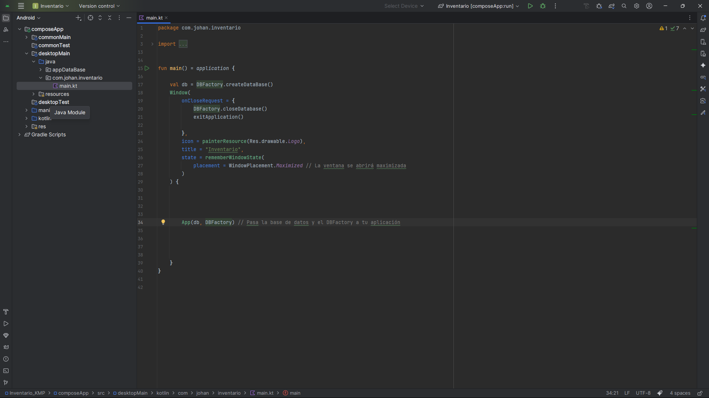
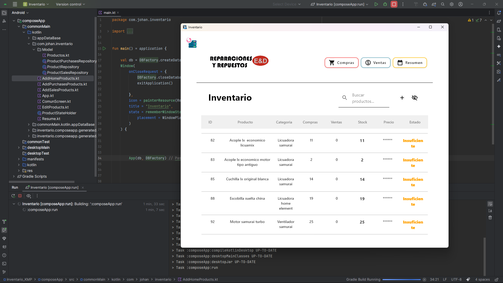
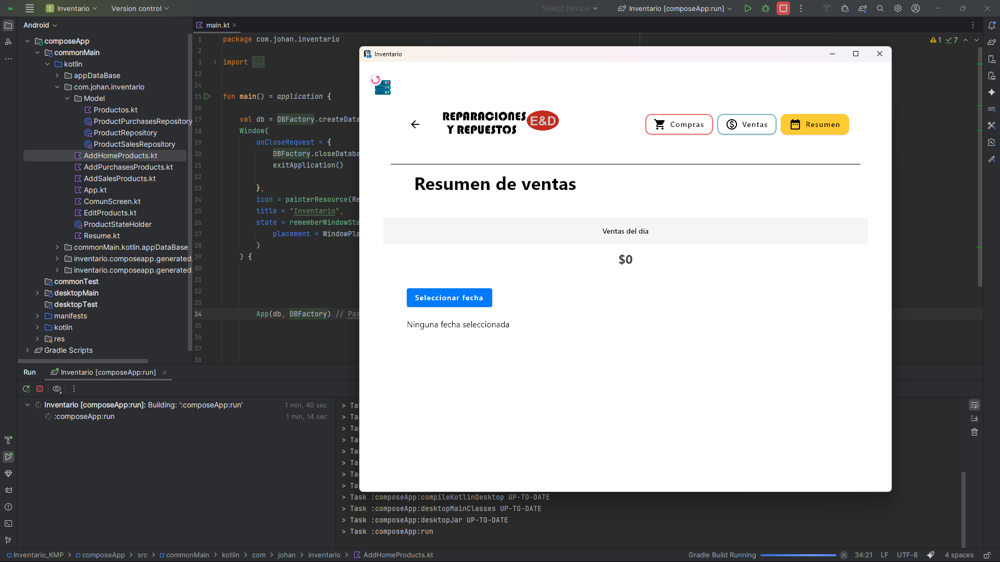

# 📦 Inventario KMP

Este es un proyecto de **aprendizaje** desarrollado con **Kotlin Multiplatform (KMP)**.  
Su objetivo es mostrar lo que se puede lograr con KMP creando un **inventario simple**, sin funcionalidades avanzadas ni optimizaciones de producción.  

> ⚠️ **Nota**: El proyecto no está optimizado y fue construido principalmente con fines educativos y de demostración.

---

## 🚀 Tecnologías utilizadas

- **Kotlin Multiplatform (KMP)** → lógica compartida entre Android y Desktop.  
- **Jetpack Compose**  
  - Compose Multiplatform (UI compartida).  
  - Compose Desktop (para generar ejecutables en Windows, macOS y Linux).  
- **Room** (almacenamiento local con KSP).  
- **AndroidX**: Lifecycle, Navigation, Activity Compose.  
- **Multiplatform Settings** (persistencia de configuraciones).  
- **Kotlinx Serialization** (manejo de JSON).  
- **Coroutines** (asincronía).  

---

## 📂 Plataformas soportadas

- **Android** (mínimo SDK configurado en el proyecto).  
- **Desktop** (Windows, macOS, Linux con empaquetado en `.exe`, `.dmg`, `.msi`, `.deb`).  

---

## ⚙️ Requisitos

- [Android Studio](https://developer.android.com/studio) o [IntelliJ IDEA](https://www.jetbrains.com/idea/).  
- Kotlin `>= 1.8.0`.  
- JDK 11.  

---
## 📸 Screenshots

### Desktop





## ▶️ Cómo ejecutar

### Android
1. Clonar el repositorio:  
   ```bash
   git clone https://github.com/tuUsuario/Inventario-KMP.git
   cd Inventario-KMP


 ## 👨‍💻 Autor
Desarrollado por **Johan Estiven Mosquera Ipuz** como proyecto de práctica con Kotlin Multiplatform.
